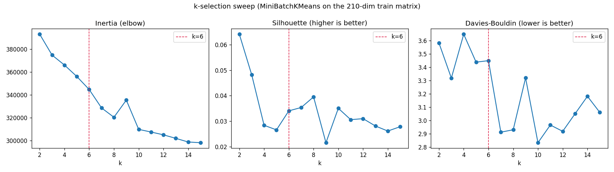

# Amazon Book Reviews: Reviewer Segmentation (Unsupervised)

[](https://github.com/pramodganar/amazon_book_reviews/actions/workflows/tests.yml)
[](https://amazonbookreviews-iskdx2dws2x2txevtrle7e.streamlit.app/)

**Live demo:** https://amazonbookreviews-iskdx2dws2x2txevtrle7e.streamlit.app/

Cluster ~300k Amazon book reviews into natural reviewer segments (how-to
reviewers, enthusiastic reactors, prolific plot-summarizers, argumentative
deep-divers, analytical essayists) and surface review topics, with **no
labels**. Pure unsupervised learning on text, writing style, reviewer activity,
and time.

## The six segments

MiniBatchKMeans, k=6, on a 210-dim feature space (200 topic dims from TF-IDF+SVD
+ 10 structural/temporal/activity features). Sizes and terms are from the train
split (`artifacts/cluster_meta.json`).

| # | Segment | Size (train) | Top terms | One-line read |
|---|---|---|---|---|
| 0 | How-to / reference | 40,418 (19%) | helpful, useful, guide, illustrations | short, practical, product-focused |
| 1 | Punchy popular-book reactor | 43,648 (21%) | loved, best, wait, buy | short, high-exclaim, hyped titles |
| 2 | Prolific plot-summarizer | 16,744 (8%) | novel, tale, war | long (~1.7k ch), ~55 reviews/user |
| 3 | General opinion | 41,712 (20%) | think, like, thought | medium length, soft catch-all |
| 4 | Argumentative deep-diver | 21,905 (10%) | question, does, people | long, ~2.2 questions/review |
| 5 | Analytical critic / essayist | 44,749 (21%) | reader, author, history, fact | long, zero questions |



## Results at a glance

- Segments are driven by **tone, length, and reviewer behavior**, not topic alone
  (top separator: rhetorical `question_count`; then review length; then user
  activity).
- Honest headline: the reviews form a **continuum**, not crisp clusters
  (silhouette < 0.08 across all k; seed-to-seed ARI ~0.32, so personas reproduce
  but exact labels churn). k=6 is the most interpretable, balanced choice.
- A **time-ordered** split exposes real drift: the "prolific reviewer" segment
  nearly vanishes out of sample because user-activity features don't transfer to
  new reviewers, a documented feature-design tradeoff.

Full write-up: [`reports/report.md`](reports/report.md).

## Data

Per the program guidelines
([`data/raw/Guidelines_to_fetch_data_from_Database.docx`](data/raw/Guidelines_to_fetch_data_from_Database.docx)),
the data is fetched from a SQLite database `clustering.db`, table
`amazon_book_reviews`. That table is the source of record; `load_raw` reads the
`.db` if present and otherwise falls back to a CSV export
(`data/raw/amazon_book_reviews.csv`, gitignored, ~260MB) — which is what is on disk
here.

**What the guidelines describe vs. what the table contains.** The accompanying
Data Card / problem statement advertise ~3M reviews and ten columns (including
`Price`, `review/score`, `review/helpfulness`, `review/summary`). The actual
`amazon_book_reviews` table is **300,000 rows** with only **six** of those columns:

`Id, Title, User_id, profileName, review/time, review/text`

The rating, price, helpfulness, and summary columns are **absent**, so there is no
star rating or helpfulness signal — every feature is derived from the text, its
shape, reviewer activity, and time. The discrepancy is stated plainly, not papered
over; see [`reports/report.md`](reports/report.md) section 1.

## Architecture

The three modules share one feature path so training and prediction are identical:

| File | Role |
|---|---|
| `pipeline.py` | all loading, cleaning, feature engineering, and the fit/transform logic |
| `train.py` | fit on the train split, persist artifacts |
| `predict.py` | load artifacts, clean/transform new reviews, assign clusters |

Everything stateful (TF-IDF, SVD, scalers, activity counts, KMeans) is fit on the
**train split only**; eval/live are transform-only. This guarantees feature parity
between train and predict time.

## Setup

```bash
python -m venv .venv && source .venv/bin/activate   # Windows: .venv\Scripts\activate
pip install -r requirements.txt
```

Python 3.11. Place the data at `data/raw/amazon_book_reviews.csv`.

## Usage

Train (fits the pipeline + model, writes `artifacts/`):

```bash
python train.py
```

Produces `artifacts/feature_pipeline.joblib`, `artifacts/kmeans.joblib`, and
`artifacts/config.json` (k, dims, train metrics, cluster sizes).

Predict / assign clusters:

```bash
python predict.py                       # scores the held-out live split
python predict.py reviews.csv           # scores any CSV with the six columns
python predict.py reviews.csv --out labelled.csv
```

Reproduce the model-selection and evaluation numbers in the report (both read the
artifacts written by `train.py`):

```bash
python experiments/model_selection.py   # k-sweep + DBSCAN/Agglomerative, rebuilds k_selection.png
python evaluate.py                       # train/eval/live metrics + centroid-distance drift
```

### Interactive app

Hosted:
[amazonbookreviews-iskdx2dws2x2txevtrle7e.streamlit.app](https://amazonbookreviews-iskdx2dws2x2txevtrle7e.streamlit.app/)

A Streamlit app lets you classify a review, browse the six segments, and see the
model-selection and evaluation story:

```bash
python analyze_clusters.py    # one-time: builds artifacts/cluster_meta.json
streamlit run app.py
```

The repo ships the fitted artifacts the app needs at runtime (pipeline, model,
cluster metadata, 2D map), so the deployed demo runs without local training; the
raw CSV is only needed to retrain or run `evaluate.py` / `model_selection.py`.

## Method summary

1. **Clean**: drop exact duplicates, bad timestamps, empty text; keep anonymous
   reviewers as distinct.
2. **Split**: time-ordered 70/20/10 by `review/time`.
3. **Features**: TF-IDF then TruncatedSVD (200) for text; six structural/tone
   features + day-of-week/year + user/product activity counts for numeric;
   `log1p` on skewed features; two blocks balanced to equal variance.
4. **Model**: MiniBatchKMeans, k=6 (chosen after an elbow/silhouette sweep and
   rejecting DBSCAN, which collapses in high dimensions; see
   `experiments/model_selection.py`).
5. **Evaluate**: internal metrics on train/eval/live, cluster-share and
   centroid-distance drift, representative reviews per cluster (`evaluate.py`).

See [`reports/report.md`](reports/report.md) for the reasoning, the cluster
"feature importance" analysis, and limitations.

## Limitations

- **Weak separation.** Silhouette stays around 0.03 to 0.04 for every usable k; the
  segments are tendencies along a continuum, not clean partitions, and c3 is a soft
  catch-all.
- **Activity features don't transfer forward.** `user_review_count` is learned on
  train; most future reviewers are unseen and map to 1, so the prolific-reviewer
  segment nearly vanishes out of sample (measured drift, report section 6).
- **Seed sensitivity.** Pairwise ARI across KMeans seeds is ~0.32: the personas
  reproduce but exact per-review labels churn, so fix the seed for a deterministic
  model and treat the segment definitions as the deliverable.
- **Diffuse topics.** LSA retains only ~16% of TF-IDF variance at 200 components,
  and `dow` ranks high as a separator largely as a low-cardinality artifact.

Full treatment in [`reports/report.md`](reports/report.md) section 7.

## Repo layout

```
pipeline.py            shared data + feature pipeline
train.py               fit and persist artifacts
predict.py             assign clusters to new reviews
evaluate.py            train/eval/live metrics + centroid-distance drift
analyze_clusters.py    build cluster metadata + 2D map for the app
app.py                 Streamlit app
experiments/           model_selection (k-sweep) and seed_stability (ARI)
tests/                 pytest suite for the pipeline invariants
requirements.txt       runtime deps (requirements-dev.txt adds pytest + matplotlib)
data/raw/              input CSV (+ Data Card, problem statement)
artifacts/             fitted objects + config (created by train.py)
reports/report.md      full write-up
reports/figures/       k-selection curves
```

## Tests

```bash
pip install -r requirements-dev.txt
pytest -q
```

Covers preprocessing correctness, feature-matrix shape, unseen-vocab/unseen-user
handling at predict time, and seed reproducibility. The suite builds tiny
in-memory frames, so it runs without the full dataset.
